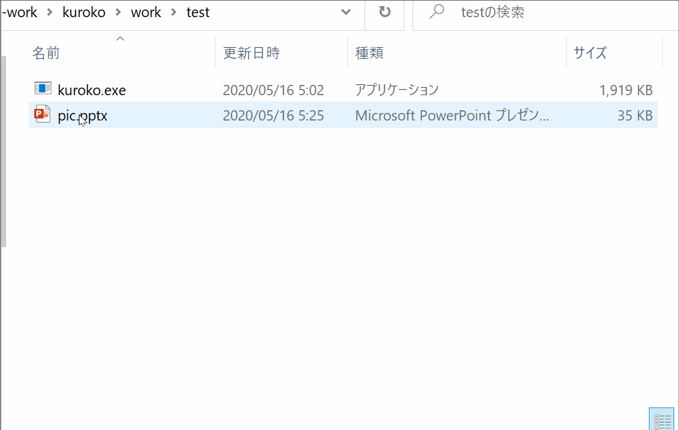

# Kuroko

Kuroko is a converter from EMF to PDF.

* It captures EMF data in a clipboard and converts it to PDF.
* In a similar way as MetafileToEPSConverter makes EPS files, you can make PDF files from pictures on MS Power Point/Excel.
* Kuroko can run only on Windows 10, because it relies on "Microsoft Print to PDF" printer.




## How to use

You should install a dedicated virtual printer before running Kuroko.

    install.bat

Capture EMF data in a clipboard and convert it to a PDF file.

    kuroko.exe -b PDF_FILE_NAME

Convert an EMF file to a PDF file.

    kuroko.exe -c EMF_FILE_NAME [PDF_FILE_NAME]


## How to build

* Install Visual Studio Build Tools 2019 - C++ Build Tools 
* Run this command
    ```
    build_shell.bat nmake build_release 
    ```
* or  
    ```
    C:\Program Files (x86)\Microsoft Visual Studio\2019\BuildTools\VC\Auxiliary\Build\vcvars64.bat
    nmake build_release
    ```
* or open it with VSCode and run a build task.


## Known issues

* Transparent objects are not converted correctly.
    * Kuroko currently uses GDI and this issue seems to be due to GDI's limitation.
    * Using GDI+ and ConvertToEmfPlus should solve this issue, but not.
    * If you set USE_GDI_PLUS in kuroko.cpp, GDI+ is enabled.
    * Any suggestions and pull-requests are welcome.
* A PDF cropping algorithm is extremely unsafe and may be broken in the future when the MS PDF printer is updated.


## License

Copyright (C) 2020 Ryota Shioya <shioya@ci.i.u-tokyo.ac.jp>
This application is released under the 3-Clause BSD License, see LICENSE.md.
